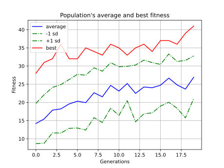

# Forest-fire simulation with "AI" agent

:fire: - orange

:evergreen_tree: - green

:fire_engine: - blue

:black_circle: - brown

[Forest-fire model](https://en.wikipedia.org/wiki/Forest-fire_model) with [agent](###Agent), wich was evolved by [NEAT](https://neat-python.readthedocs.io/en/latest/). It is evolving neural network by genetic algorithm, where neural network maps neighbourhood states to action space.

### Agent:
Has five actions:
* stay
* up
* down
* left
* right

If the agent at end of the action stays on the fire, extinguishes the tree.

### Results:
Number of extinguished trees in this environment setting (env. size: (16, 16), epochs: 50, p: 0.5, f: 0.08). Evaluated on 50 Monte Carlo simulations.:
* lazy agent - 28.7
* random agent - 11.82
* evolved NEAT agent - 29.36
It looks like the lazy policy is quite good.

## TODO
* clean code
* fix animation
* rewrite enviroment update
* play with parameters
* experiment with other eviroment rules
* change mlp for cnn